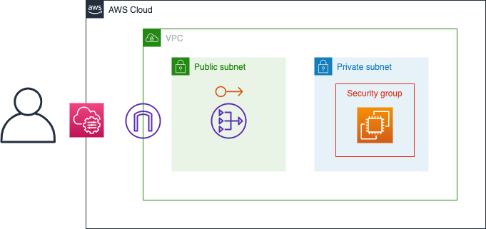

# AWSでプライベートサブネットにSSHするための構成
## Diagram


## Usage
```
git cline https://github.com/ryu022304/terraform-private-subnet-ssh.git
cd private-subnet-ssh
vi main.tf
  edit bucket name
terraform init
terraform apply
  input private key value
```
